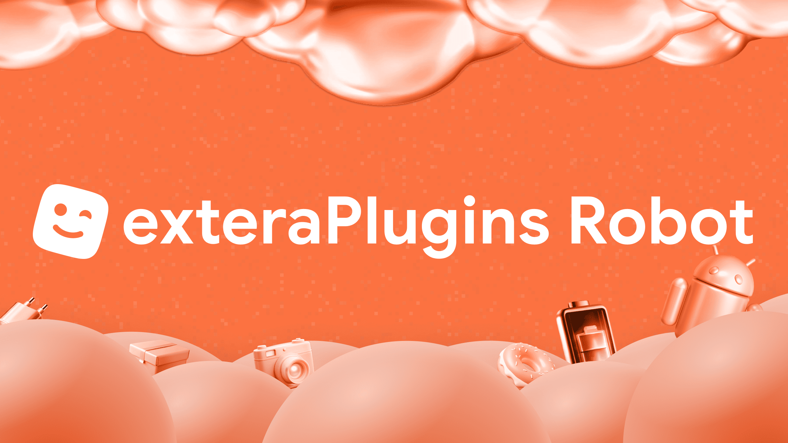

# exteraPluginsRobot

Just a base bot for Telegram, writen on aiogram for my [Telegram channel](https://t.me/exteraPluginsSub)

Fully working bot: [@exteraPluginsRobot](https://t.me/exteraPluginsRobot)

# Features:
- Plugins/Iconpacks Catalog in bot and inline with search by search in descripsion or name (@exteraPluginsRobot ...)
- Suggested plugins/iconpacks
- Kicks everybody who trying to join your group.
- Parse data from file .plugin/.icons

# Setup (Classic)
1. Install dependencies
2. Configure `config.json`
3. Run bot by ```python3 main.py```

# SQLite storage
Storage backend is SQLite (`storage.sqlite3`).

Configure path in `config.json`:

```json
"storage": {
  "data_dir": "data/data",
  "sqlite_path": "data/data/storage.sqlite3"
}
```

You can also override at runtime with env vars:
- `DATA_DIR`
- `SQLITE_PATH`

# Docker Compose
1. Configure `config.json` in project root.
2. Start bot:
   - `docker compose up -d --build`
3. View logs:
   - `docker compose logs -f bot`
4. Stop:
   - `docker compose down`

## Userbot authorization (one-time)
Before running authorization, set in `config.json`:
- `userbot.api_id`
- `userbot.api_hash`

Run interactive authorization flow to create `sessions/userbot_session.session`:

`docker compose --profile tools run --rm auth`

In the prompt:
- enter phone number in international format (`+...`)
- enter code from Telegram
- if enabled, enter your 2FA password

After successful login, restart bot:

`docker compose restart bot`

## Re-authorization
If you need to log in with another account, remove previous session and run auth again:

`sudo rm -f sessions/userbot_session.session*`
